# AI_whiteboard

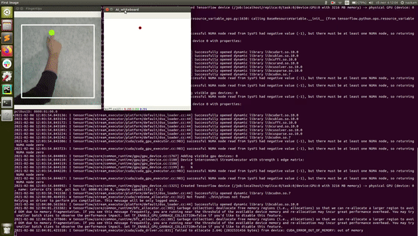

## Idea

The idea of this project is quite interesting. 
I want to transform any wall or surface into an interactive whiteboard just with a camera and your hand!

## Hardware

- Jetson Xavier NX 
- Raspberry Pi Camera + ArduCam (8MP IMX219 Sensor Module)

## Details

We capture an image from a camera. Then we crop this image into a square. Next, we use **a hand detector[1]  (YOLO - deep neural network)**,to find a hand in the image. If there is a hand in the image, we crop that hand out of the image and feed it to **a Fingertip detector[1]  (modified VGG16 - deep neural network)**. Next, if we can detect fingertips, we use their coordinates to control the whiteboard (See the control section below). 

## Launch AI Whiteboard

##### 1. Set up your NVIDIA Jetson Device or use your PC.

##### 2. Download AI Whiteboard project. `$ git clone https://github.com/preste-ai/camera_ai_whiteboard.git `

##### 3. Install packages
You can download needed packages via pip using the `requirements.txt` file:

```python
  pip3 install -r requirements.txt
```

##### 4. Create three subfolders: `saved`, `weights` and `weights/engines`.

```
    ai_whiteboard
	├── custom_dataset
	├── fingertips_detector
	├── hand_detector
	├── images
	├── saved
	├── weights
	│   └── engines
	├── ai_whiteboard.py
	├── config.py
	├── gst_cam.py
	├── h5_to_trt.py
	├── LICENSE
	├── metrics.py
	├── README.md
	├── trt_utils.py
	├── yolo_test.py
	└── yolo_train.py

```

##### 5. Download [weights or TensorRT engines](https://drive.google.com/drive/folders/1eDBqbZfoY7XJ3fYv8FEMJ5AZe_3n0sjU?usp=sharing) and put it to `weights` or `weights/engines`.

##### 6. Run AI whiteboard script. 

`$ python ai_whiteboard.py --rpc --trt --hd 0.8 --ft 0.5`
- rpc : If you want to use a Raspberry Pi Camera. Default: False
- trt : If you want to use TensorRT engines. Default: False
- hg : confidence threshold of Hand detector. Default: 0.8
- ft : confidence threshold of Fingertips detector. Default: 0.5

###### Control gesture (combination)
| To draw | To move | To erase | To clean | To save | 
|:---------------:|:---------------:|:---------------:|:---------------:|:---------------:|
|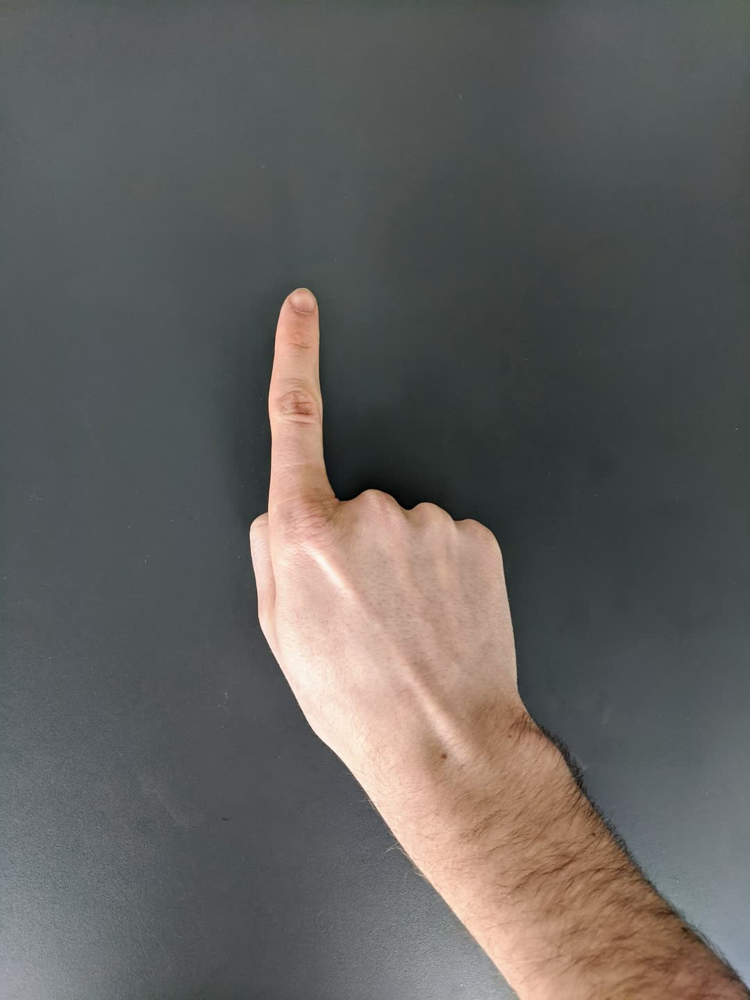|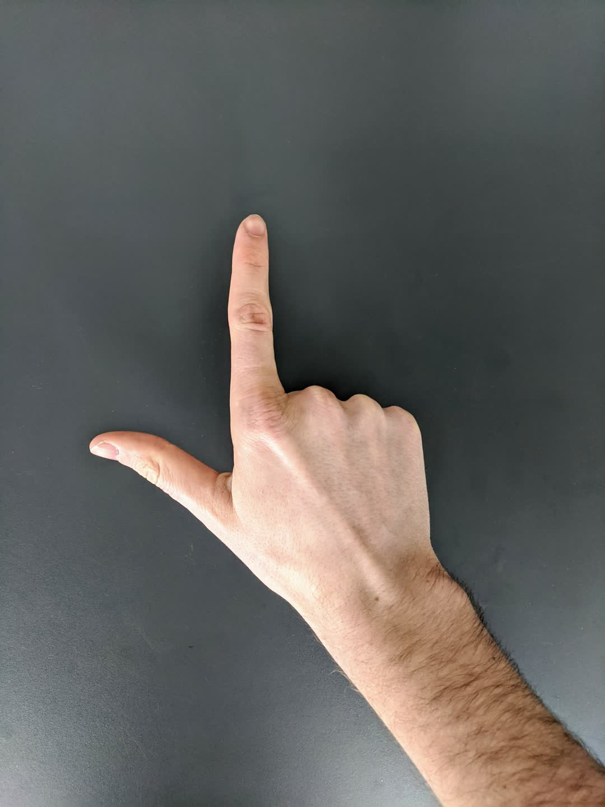|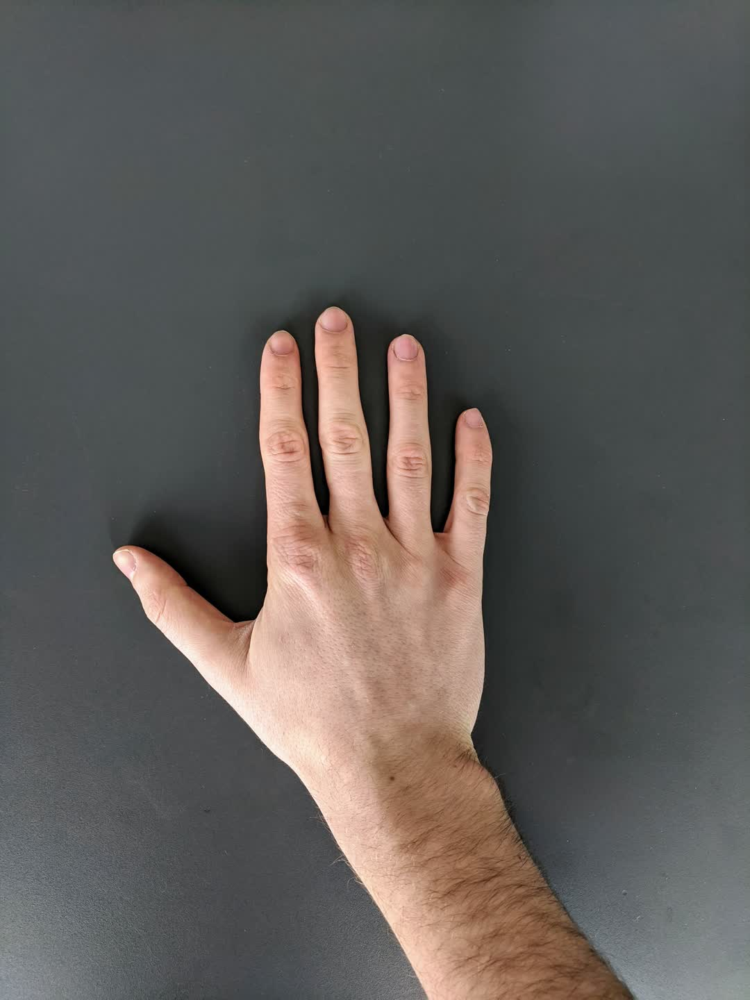|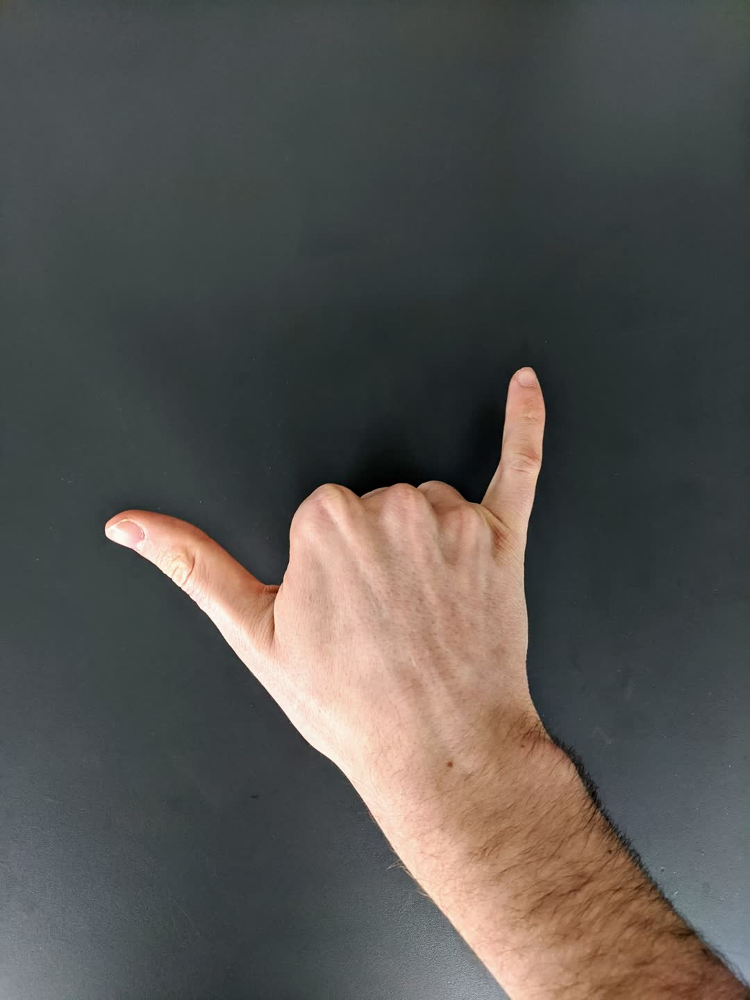|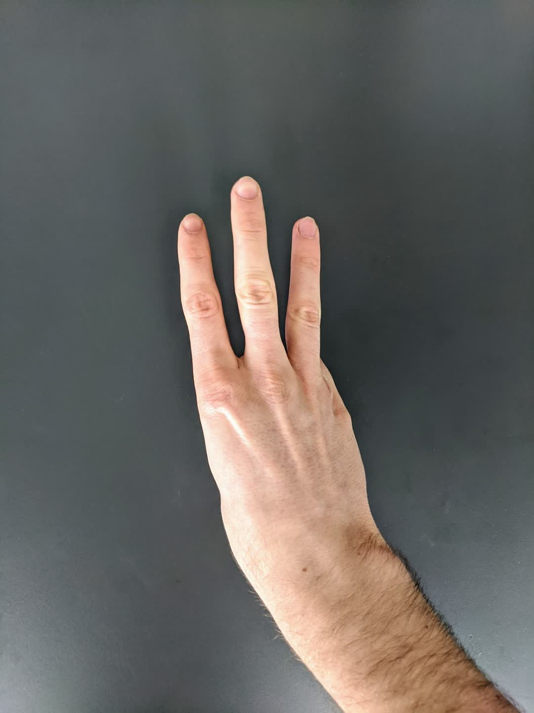|
 

## Train Hand-detector

`$ python3 yolo_train.py`

#### Custom Dataset

A custom dataset was collected and labeled (12,000 images) for training. For labeling I used [CVAT](https://github.com/openvinotoolkit/cvat).

- Train: 9,500 images
- Validation: 1000 images
- Test : 1500 images

|  |  |  |  |  | 
|:---------------:|:---------------:|:---------------:|:---------------:|:---------------:|
|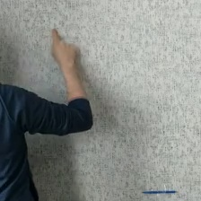|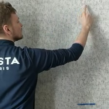|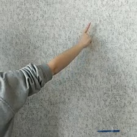|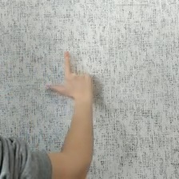|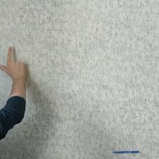|
|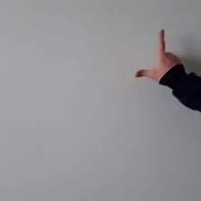|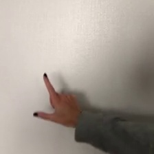|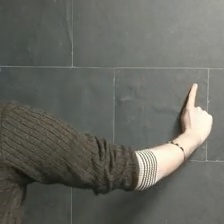|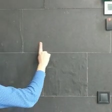|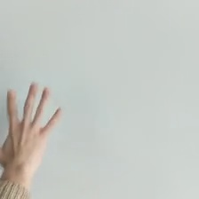|
 


## Test Hand-detector

`$ python3 yolo_test.py`

## Convert .h5 model to TensorRT engine

`$ python3 h5_to_trt.py --folder weights --model_name model_yolo`

## Performance

|  | keras model | TensorRT engine (fp32) | TensorRT engine (fp16) | 
|:---------------:|:---------------:|:---------------:|:---------------:|
| Average FPS | 25 | 40 | 70 |
| Accuracy    |  |  |  |
| Precision   |  |  |  |
| Recall      |  |  |  |


## References
1. Unified Gesture and Fingertip Detection : https://github.com/MahmudulAlam/Unified-Gesture-and-Fingertip-Detection